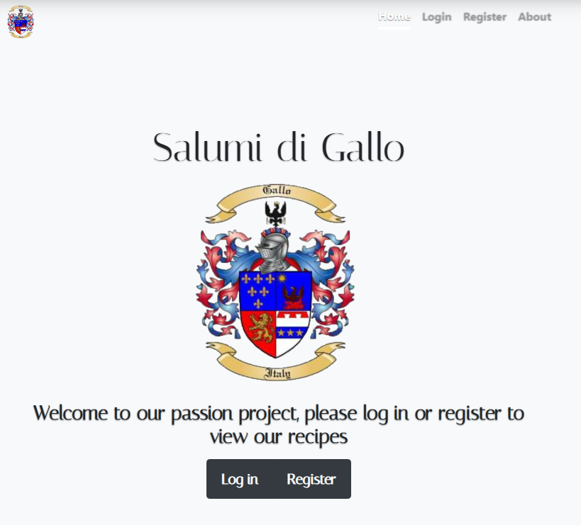
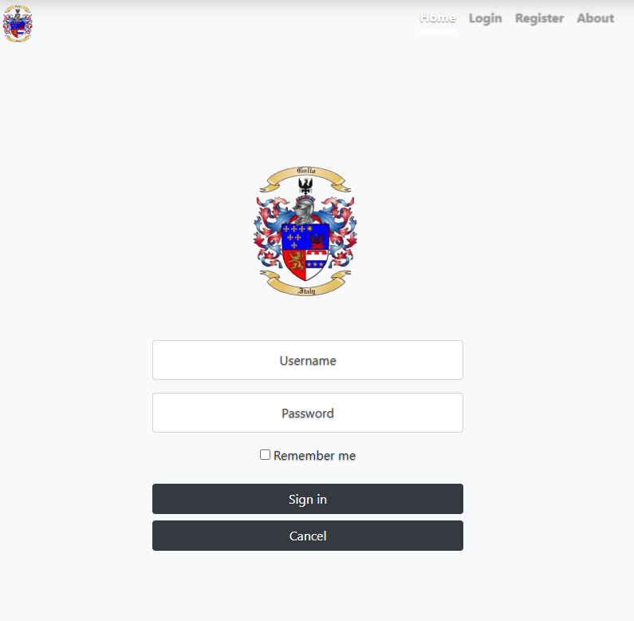
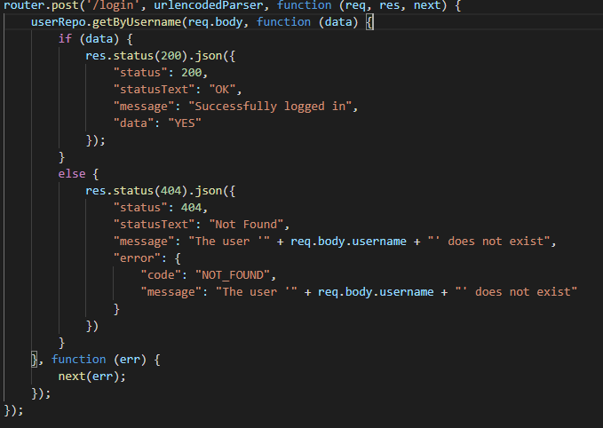
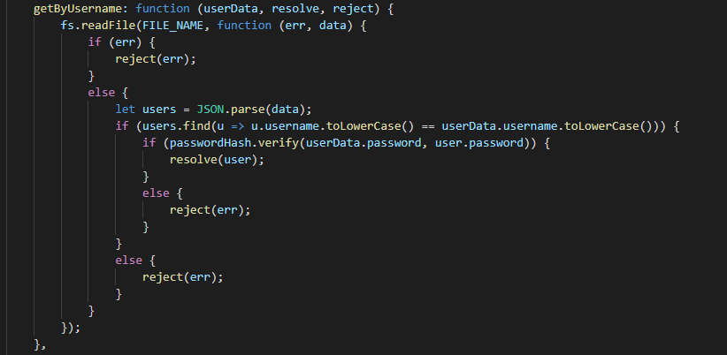
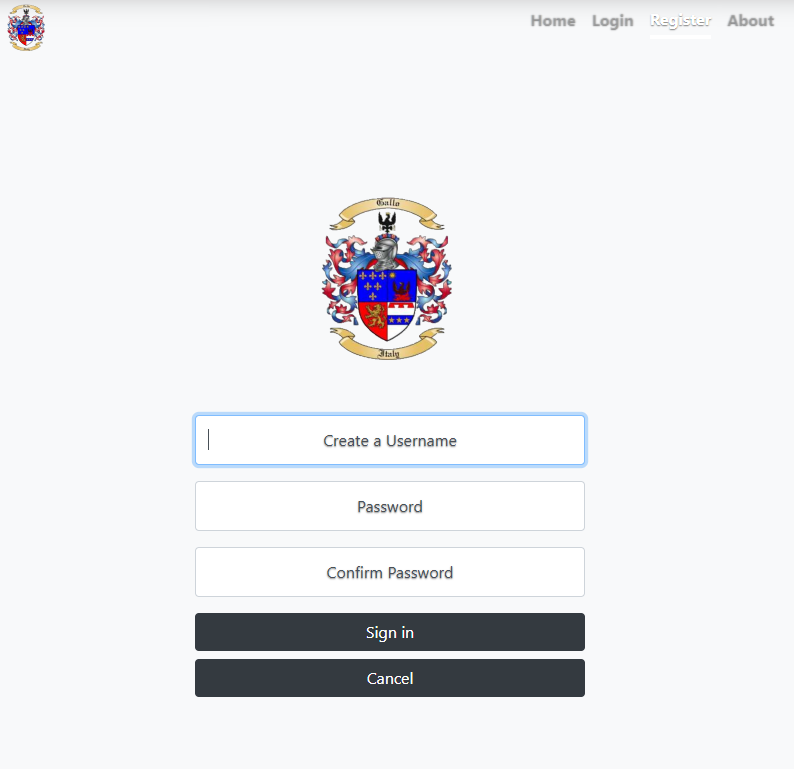
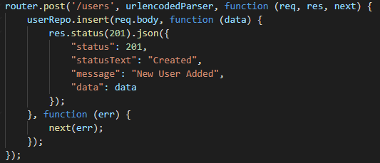
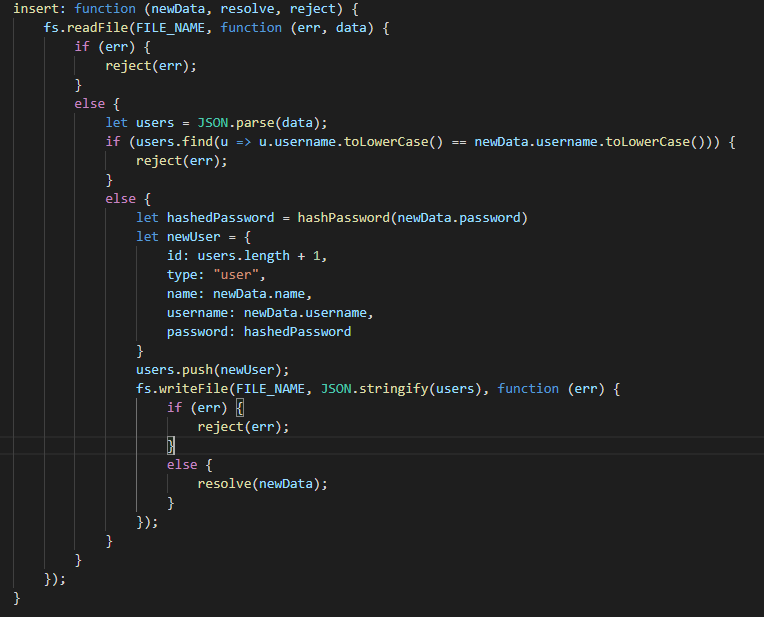
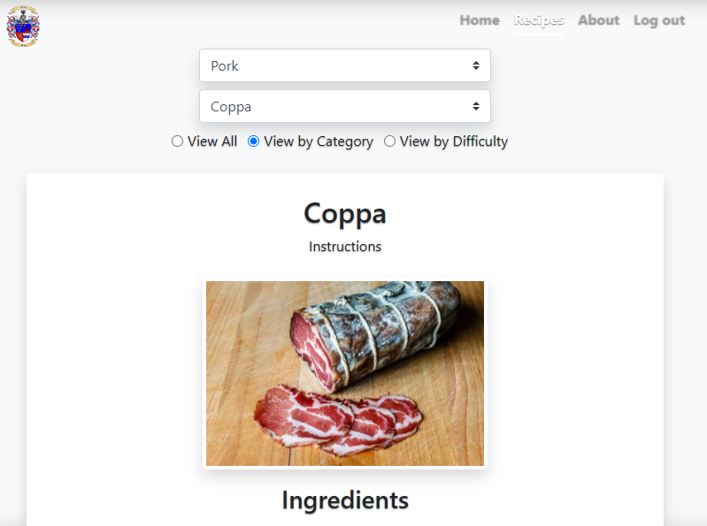
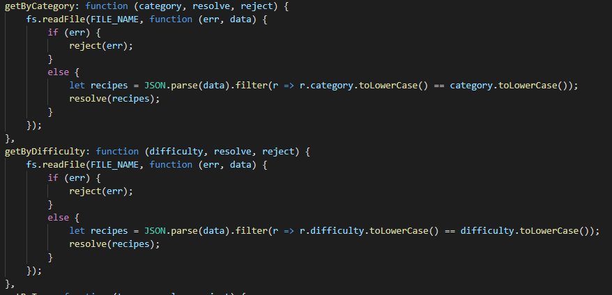

# Salumi-Di-Gallo-Angular
 A recipe website for cured meats. The purpose is for readers to come to the site, search through available recipes and get the information they need to make it themselves. Users must make an account to view the available recipes. Adding, editing, or removing recipes will be reserved for users with admin access.

 ****

On the backend this website will:
 - be a converted to angular app
 - encrypt user passwords for security (*password hashing*)
 - be a custom rest api node server which will feature:
    - modules
    - methods
    - an exception log
    - JSON envelopes for more detailed data transmission 

 ****
## Required info
 Must open a cmd prompt to "... /Salumi-Di-Gallo-Angular/server" and run `npm install`
 - Server Runs on http://localhost:8081 
 `npm start` to start server

 Must open a cmd prompt to "... /Salumi-Di-Gallo-Angular/client" and run `npm install`
 - Client app runs on http://localhost:4200
 `ng serve` to start angular

 `Ctrl+C` to kill server

 **For testing user the below credentials, or make your own through the register page:**

 
| Username      | Password      | 
| ------------- |:-------------:| 
| admin         | password      | 
   

### Landing page
***
User is greated by the website name, logo, description, and login and register buttons

### User log in
***
The user login page will take in a username and password. 

On the backend, it will check to see if the username exists, if it does it will check if a hash of the login password matches the stored hashed password. If it matches, a validation is passed to the server letting the user into the site.

### User creation
***
The user registration page will take in a username and password, the public JS file will have a confirm password validation. 

On the backend logic is placed to prevent duplicate usernames, if that check is passed the entered password is hashed.

### Recipes page
***
After a succesful login the user will be greated with the content page. It allows the user to search through available recipes and choose one to view.
If the user logging in has a user type of "admin" a new nav link is available for "Add new recipe"

There are three radio buttons to filter search criteria. The default, view all has just one Ddl populated with all recipe name. Picking any of the other two fills the Ddl with the search criteria and generates a second Ddl with the recipes matching that criteria. Choosing a recipe generates the recipe below

